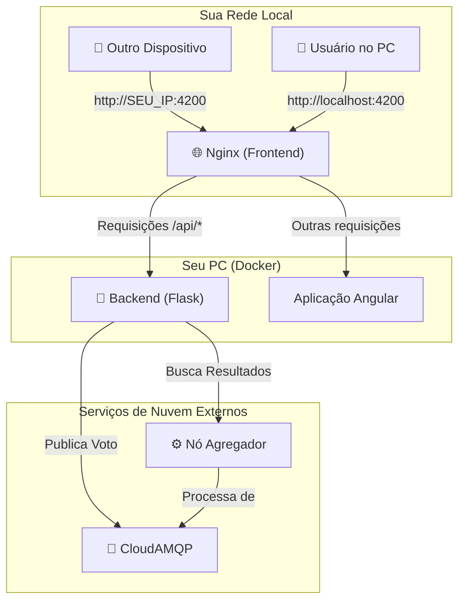

# 🗳️ Sistema de Votação - Cliente Dockerizado

Bem-vindo! Este é um sistema de votação completo, conteinerizado com Docker. Ele foi projetado para funcionar como um cliente de uma arquitetura distribuída, permitindo que usuários votem em candidatos e visualizem os resultados em tempo real através de uma interface web moderna.

## ✨ Principais Funcionalidades

-   **Interface Intuitiva:** Frontend em Angular para uma experiência de usuário fluida.
-   **Backend Robusto:** API em Python (Flask) para processar os votos.
-   **Pronto para a Nuvem:** Integra-se com serviços de mensageria (RabbitMQ) e um nó agregador externo.
-   **Acesso na Rede Local:** Permite acesso de qualquer dispositivo na sua rede.
-   **Setup Simplificado:** Funciona "out-of-the-box" sem configurações adicionais.

---

## 🏛️ Arquitetura e Fluxo de Dados

A aplicação utiliza o **Docker Compose** para orquestrar os serviços. O **Nginx**, dentro do contêiner do frontend, atua como um **Reverse Proxy**, redirecionando as chamadas de API para o backend. Isso é o que permite que a aplicação funcione perfeitamente quando acessada de outros dispositivos na rede.



---

## ✅ Pré-requisitos

Você só precisa de uma ferramenta instalada:

-   [**Docker**](https://www.docker.com/products/docker-desktop/): Inclui o Docker Compose (que já vem com o Docker Desktop para Windows e Mac).

---

## 🚀 Guia de Execução Passo a Passo

A aplicação está **pré-configurada** e pronta para funcionar imediatamente! Não é necessário criar arquivos de configuração adicionais.

### Passo 1: Inicie a Aplicação com os Scripts

-   **Para a primeira execução ou para aplicar mudanças no código:**
    *Este comando reconstrói as imagens do Docker, garantindo que tudo esteja atualizado.*
    ```bash
    ./start.sh
    ```

-   **Para uma inicialização rápida (se as imagens já existem):**
    *Este comando apenas sobe os contêineres já existentes.*
    ```bash
    ./start-fast.sh
    ```

### Passo 2: Acesse a Aplicação
Após iniciar os contêineres, espere alguns instantes e acesse a interface no seu navegador:

-   **Endereço:** [**http://localhost:4200**](http://localhost:4200)

### Passo 3: Pare a Aplicação
Para parar todos os contêineres e limpar os recursos, use o comando:
```bash
./stop.sh
```

---

## 📁 Estrutura do Projeto

```
/
├── backend/            # Código da aplicação Backend (Python/Flask)
│   ├── app.py          # Arquivo principal da API
│   ├── dockerfile      # Define a imagem Docker do backend
│   └── ...
│
├── frontend/           # Código da aplicação Frontend (Angular)
│   ├── src/            # Código-fonte do Angular
│   └── dockerfile      # Define a imagem Docker do frontend
│
├── docker-compose.yml  # Orquestra os serviços (com variáveis de ambiente incluídas)
├── start.sh            # Script para CONSTRUIR e iniciar os contêineres
├── start-fast.sh       # Script para INICIAR contêineres já construídos
└── stop.sh             # Script para PARAR e limpar os contêineres
```

---

## 🌍 Acesso na Rede Local (de outros dispositivos)

Para testar em um celular, tablet ou outro computador na mesma rede:

#### 1. Encontre seu Endereço IP Local
   No Windows, abra o `cmd` ou `PowerShell` e digite `ipconfig`. No Mac/Linux, use `ifconfig` ou `ip addr`. Procure pelo seu **Endereço IPv4** (ex: `192.168.1.10`).

#### 2. Libere a Porta no Firewall (se necessário)
   Sistemas como o Windows podem bloquear conexões de entrada por padrão. Você precisa criar uma regra para permitir o tráfego na porta `4200`.
   -   **No Windows:**
        1.  Abra o **"Firewall do Windows com Segurança Avançada"**.
        2.  Vá para **"Regras de Entrada"** > **"Nova Regra..."**.
        3.  Selecione `Porta` > `TCP` > `Portas locais específicas: 4200`.
        4.  Selecione `Permitir a conexão` e aplique aos perfis de rede desejados (geralmente `Particular`).
        5.  Dê um nome à regra (ex: "Docker App") e salve.

#### 3. Acesse pelo outro dispositivo

Use o endereço IP do seu computador no navegador do outro dispositivo:

**Exemplo:** `http://192.168.1.10:4200`